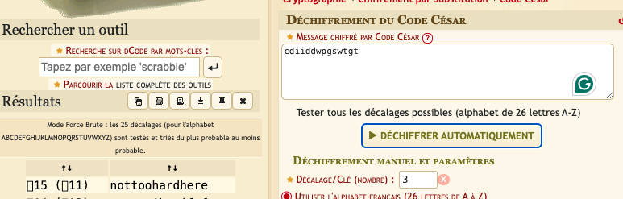

Recherche d'un fichier avec la commande 
```bash
find / -user flag00
```
On vois un fichier nommée john qui affiche : *cdiiddwpgswtgt*
Si on entre cette chaîne dans l'outil déchiffrement du code césar de decode.fr on obtient 

Il nous reste donc à nous connecté a flag00 avec ce password en éxécutant la commande 
```bash
su flag00
```
```bash
Password: nottoohardhere
```
On éxécute la commande pour récupérer le password du level suivant :
```bash
getflag
```
```bash
Check flag.Here is your token : x24ti5gi3x0ol2eh4esiuxias
```

