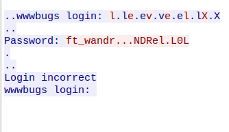
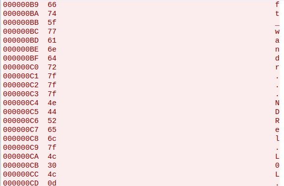

On obtiens un fichier .pcap.
On le copie en vue d'utiliser l'outil CloudShark pour lire les trames tcp
```bash
scp -P 4242 level02@127.0.0.1:/home/user/level02/level02.pcap .
```



Les . sont en réalités des caractéres DEL : (ascii 127)



Le flag est donc **ft_waNDReL0L**

On se connecte au user flag02 puis on éxécute getflag : 
```bash
getflag
Check flag.Here is your token : kooda2puivaav1idi4f57q8iq
```